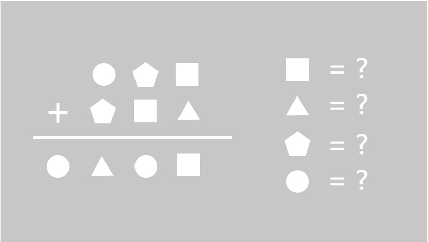


When faced with the light, shadows linger behind us. - Helen Keller



"Welcome, everyone, to the Outsider Chamber. I am the chamber's host, and you may call me Little A!" In the waiting room, the five-person escape team has assembled, and a cheerful and energetic young girl is introducing the chamber's instructions.

"I have two pieces of good news for you all. Firstly, there is a grand prize for the first team to successfully escape, which no one has achieved so far. Secondly, there is a speed prize. If the record of the first team remains unbroken for six months, they will also receive a second prize."

"Is the grand prize still available? I saw someone mention on a popular review site that it has already been claimed... By the way, what are the prizes?"

"The grand prize grants the winners free admission to any chamber in the city for six months, with unlimited visits. The speed prize is an invitation to a lunch meeting with the world's top-ranking detective novelist. So, what do you think? Is it worth taking a chance?"

The five individuals exchange glances and give their teammate a mischievous smile.

"However, the grand prize does come with conditions. Each of you must sign a confidentiality agreement, promising not to disclose any information about the chamber's puzzles or any other related details. Failure to comply will result in substantial compensation claims." Little A smiles cunningly, revealing a small gap between her teeth.

"No wonder the positive reviews are so vague. I didn't realize there were such strict confidentiality requirements."

"Alright, everyone, once you've signed, let me explain the rules. Firstly, players can seek assistance through the intercom to progress or even complete the chamber. There is no limit to the number of times you can ask for help. However, once you use the assistance, you will no longer be eligible for the grand prize. Players who have used assistance will be recorded and will never be able to challenge the same theme again. If the request for help is due to reading difficulties or technical malfunctions caused by lighting or prop settings, it will not be considered assistance. The players who mentioned successfully completing the chamber actually managed to do so with the help of assistance, so they cannot be considered true winners."

"Rule number two: some puzzles require players to submit the correct answers or unravel the mysteries of certain items. For these types of puzzles, players only have two submission opportunities. If they fail to solve the puzzle within these two attempts, it will be regarded as a failed attempt. Players can then choose to use assistance to complete the chamber or simply wave goodbye to the camera to exit the game."

"Really? No seeking assistance and no room for trial and error? Isn't that too difficult?"

"After all, there is a grand prize at stake. If the rules aren't strict, we would be at a loss." Little A winks. "Besides, I must clarify that there is still a chance for trial and error. Originally, there was only one submission opportunity, but the boss was generous enough to grant an additional opportunity to prevent challengers from making mistakes due to nervousness."

"Well, that's... quite generous indeed."

"Alright, Tian Tian and Yi Yi, stop whispering. Haven't we always been unstoppable as a team? We have intelligence, physical strength, and the appearance. Moreover, we didn't just stumble upon our talents." Mo Yu smiles and says. He is an investigative journalist with excellent observation, organizational, and communication skills. The team has always appointed him as the captain, responsible for carrying the intercom and making jokes to liven up the atmosphere.
"Just stop calling me 'talented.' I just happened to accidentally unlock the code lock once. I know it's not right to use brute force, so please stop mentioning it..." Lin Yi Yi frowns and mutters.

"Yi Yi, Mo Yu means that luck is also part of skill." Si Nan places his hand on Yi Yi's shoulder and looks into her eyes with a gentle yet firm expression. As a psychologist and her boyfriend, his soothing words have an immediate effect, and Lin Yi Yi's face instantly clears up.

"Woof woof woof! We all just had lunch, so there's no need to feed us yet..." The scene momentarily descends into chaos.

"Cough cough, Little A, please finish any remaining instructions." As the team's intellectual backbone, Wu Hen prefers to keep things concise.

"Please remember your mission in the chamber. You are five private detectives, brought in by the inspector, to help find a missing child. The specific details of the case will be thoroughly examined once you enter the chamber.

Friendly reminder: if you encounter a challenge that seems insurmountable, you can contact me through the intercom. That's all. If there are no further questions, I will lead you to the chamber."

…………

The lights illuminated, and five individuals removed their blindfolds. Before them lay a vast expanse of pure white, with a strikingly white door standing prominently in their midst.

"Did we just come in from the office building? Isn't this locked room a bit too grandiose?" Tiantian raised her head, gazing at the nearly five-story tall double doors in front of her. The door panels resembled jade, with a translucent whiteness. The intricate relief on the door pillars came to life, with exquisite lines intertwining with intricate patterns, creating a mesmerizing spectacle under the intense lighting. Tiantian became enraptured, unable to resist reaching out and touching the door.

"Hold on!" Both Sinan and Wuheng exclaimed simultaneously, but it was too late. Tiantian's hands had already pressed against the door, exerting all her strength to push it open.

Yue Tiantian, the renowned gold medal fitness trainer, exceptional outdoor leader, expert climber, acted instinctively the moment she touched the door, channeling the energy of her entire body into the endeavor. The door remained immovable, but a set of patterns gradually appeared on its white surface.

"Oh, so this door isn't meant to be pushed..." Tiantian was about to retract her hands when Wuheng said, "Don't let go. We don't know what mechanism you triggered. Let us solve this puzzle first. Next time, be more observant before taking action. Opportunities are limited, fortunately, we didn't waste one."

"Well, Tiantian, this door seems quite peculiar. Let's refrain from moving it haphazardly and avoid any potential dangers," Sinan advised.

Just as Yue Tiantian was about to retort to Wuheng, he directly announced aloud, "3, 0, 8, 1."

The door opened slowly, allowing a gentle breeze to waft in, accompanied by the sounds of birds and the fragrance of flowers. Warm sunlight bathed the group, casting their shadows behind them.

