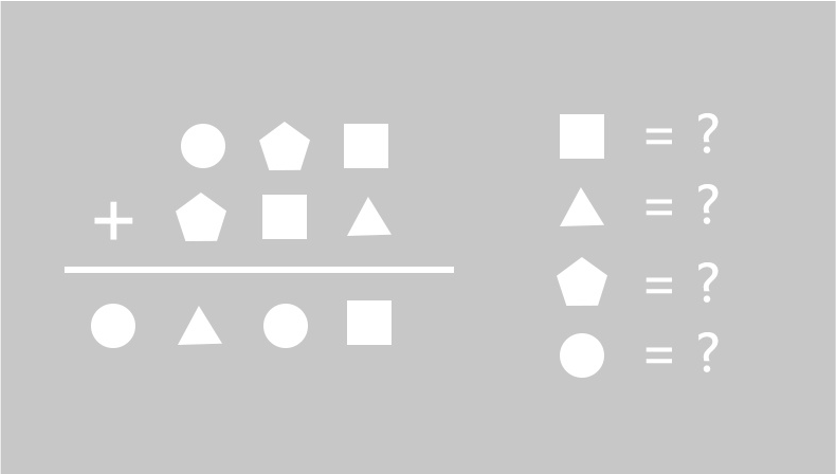


面对光明，阴影就在我们身后。 —— 海伦·凯勒



“欢迎各位来到Outsider密室，我是密室主理人，大家可以叫我小A！”等候室内，五人密逃小队集结完毕，一位爱笑的元气少女正在介绍密室的注意事项。

“告诉大家两个好消息，本密室设有首通大奖，至今还无人达成；本密室同时还设有速通大奖，如果首通小队的记录在半年内还无人打破的话，就可以同时得到第二份大奖哦～”

“首通大奖还在吗？我看大众点评上有人说已经通关了啊……话说奖品是什么啊？”

“首通奖品是本市任意密室费用的全免资格，为期半年，不限次数；速通奖品是与世界推理作家榜榜首的午餐会资格。怎么样？值得各位放手一搏吧？”

五人彼此交换了下眼神，心照不宣的给了队友一个邪魅的浅笑。

“不过嘛，大奖是有条件的。诸位先要签署保密协议，不得以任何形式泄露密室的谜题以及和密室有关的任何信息。否则，会面临高额索赔哦～”小A狡黠的笑着，露出了小虎牙。

“难怪好评都写的那么笼统，原来还有这么严格的保密要求。”

“好啦，各位签完来听我说下规则。第一：玩家可以通过对讲机求助来推动甚至完成密室，次数不限。一旦使用了解题求助，就失去大奖挑战资格。使用过解题求助的玩家将被记录，离场后永远不能重复挑战本主题。由于场内灯光、道具设置等引发的阅读困难或者故障，导致玩家求助的，不记为解题求助。刚刚你们提到的通关者，实际都是用解题求助勉强完成了密室，所以不算真正通关哦～”

“规则二：部分谜题需要玩家提交正确的答案或物品解谜，此类谜题只有两次提交机会，用完后如谜题未解开，则视为解谜失败，玩家可选择使用解题求助完成密室或对着摄像头挥手表示退出游戏哦～”

“不是吧？不让求助，也不给试错，会不会太难了点？”

“毕竟有大奖啊，要是规则不严苛点，我们不得赔死。”小A眨眨眼，“况且，不能说完全没有试错机会哦，本来是只有一次提交机会的，老板慷慨大方，怕挑战者手抖弄错了，就多加了一次哦～”

“这还真是……颇为大方。”

“好啦，天天和一壹你们俩别嘀咕了，咱们组合不是历来所向披靡吗？智力、体力、门面担当一个不缺，再说一神也不是白给的啊。”墨羽笑着说，他是个调查记者，观察力、组织和沟通能力都是一流的，大家一直让他担任密室的队长，主要负责拿对讲器和插科打诨，活跃气氛。

“都说了别叫什么一神，不就是误打误撞一次就解开了密码锁嘛，我也知道暴力破解不对，不要一直说一直说……”林一壹皱着眉头嘟囔着。

“一壹，墨羽的意思是，运气也是实力的一部分。”司南搭着一壹的肩膀，认真看着她的眼睛，温柔而坚定的说道。心理咨询师男友的安抚作用立竿见影，林一壹瞬间多云转晴了。

“汪汪汪，大家都刚吃过中饭，现在还不用喂呢……”场面一度混乱。

“咳咳，小A，还有什么注意事项一次说完吧。”作为队伍的智力担当，无痕向来言简意赅。

“大家请牢记密室任务，你们是探长请来的5位私家侦探，要帮忙寻找一位失踪的小朋友。具体案情，大家进入密室再仔细研究。温馨提示，如果遇到力所不能及的关卡，可以通过对讲器跟我联系。以上。没问题的话，就带大家去密室了哦～”

…………

灯光亮起，五个人摘掉眼罩，眼前一片雪白，一扇同样雪白的门突兀的伫立在众人眼前。

“这……刚刚是从写字楼进来的吧？这个密室，是不是有点太大手笔了？”天天抬起头，望着面前将近5层楼高的两扇大门，门扇仿佛是玉质的，白中透亮，门柱上的浮雕栩栩如生，精美的线条与复杂的纹饰交织在一起，交相辉映，在强烈灯光下，闪着微光。天天看得入了迷，禁不住伸手去触摸门扇。

“先别动！”司南和无痕同时喊了出来，可惜为时已晚，岳天天双手已经撑在门上，正在用力推开。

岳·金牌健身教练·优秀户外领队·攀岩达人·天天，在接触门的瞬间就凭借本能使出了全身的力气。门，纹丝不动，白色的门扉上却慢慢浮现出了一组图案。

“啊，原来这门不是推的啊……”天天正想缩手，无痕却说：“别放手，不知道你触动了什么机关，等我们解完这道题目先。下次看清楚点再行动，机会有限，还好没浪费。”

“嗯，天天，这个门有点怪怪的，还是别乱动，别碰到啥危险。”司南说道。

岳天天正准备回呛无痕两句，无痕直接朗声报出：

“3，0，8，1。”

大门缓缓打开，门内和风阵阵，鸟语花香，和煦的阳光照在众人身上，也把他们的影子映在了身后。

