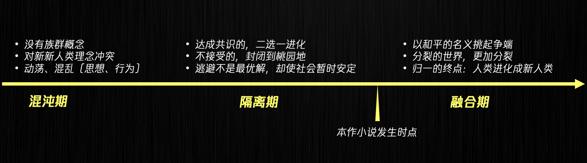


Based on this novel, extending the imagination to the gaming industry.



## Background

In the future world, technology and civilization have reached a highly advanced state, allowing individuals to choose to upgrade and enhance their brains or bodies. After years of development, two sub-species of humans have emerged: the "Sages," who strive for superior intelligence, and the "Vigorous Adventurers," who seek to surpass physical limits. These groups are recognized as the mainstream society's definition of humanity. Additionally, there are also completely artificial beings known as "androids," who possess rudimentary consciousness and emotions and primarily act based on the commands of humans (including the sub-species).

Simultaneously, in a hidden corner of the world, there exists a group of humans (known as the "Original Humans") who refuse any form of modification. Their ancestors believed that maintaining the natural attributes of humans is the essence of true humanity. This particular group reached an agreement with the evolving human society when the sub-species emerged, choosing to live apart and establish their own utopia. Over the years, they have remained physically and informationally isolated from the rapidly advancing external society, akin to a secluded paradise.

As time passes, the Original Humans gradually become aware of the existence of the outside world, experiencing a strong sense of doubt and nihilism. The ongoing debate in the external society regarding whether the Original Humans should be given a chance to choose anew intensifies, leading to preparations for their potential integration.

Given that the current human society comprises the Sages, Vigorous Adventurers, and androids, each with their unique characteristics, but indistinguishable in appearance, guiding the Original Humans to reacquaint themselves with humanity and integrate into these sub-species becomes a primary consideration in preparation. To address this, the World Government establishes the Utopia Laboratory and initiates the "Wuling Project" as the first step in guiding the Original Humans...

## The cosmology of the game

From the final chapters of the novel, we can discern the author's meticulous construction of the entire worldview.
Humanity has segregated into four distinct ethnographic groups (imprecisely put, they could also be referred to as subspecies):

- The cognoscenti
- The adept
- The androids
- The primordial beings

These four groups have plunged the already intricate human society into even greater complexities.

On one hand, there are fluctuating and conflicting sentiments of curiosity, conflict, comprehension, and coexistence towards the neo-human species, all playing out in various scenarios, leaving individuals in a state of ambivalence and inner turmoil.

On the other hand, the fundamental order of society is continuously subject to the natural laws of segmentation and integration, perpetually evolving through iterations to ultimately progress towards unity.

**The introductory part of this novel serves as a prologue, establishing the foundational elements and underlying points of conflict, while delineating the entire cosmology into three distinct stages:**

## Initial exploration of gameplay

Based on the foundational premise of training an AI model, as well as the requirement to complete a task for each training session, this game has been designed with an intra-game and inter-game dual-loop system.

### Intra-game mechanics

Intra-game core: Task-oriented gameplay

Each experiment corresponds to a task process.

Types of tasks: Strong PVE focus (cooperative benefits outweigh solo benefits)

RPG, puzzle-solving, combat, rescue missions, and more.

Task objectives: Collecting data necessary for training the model, including:

- Population classification - similar to the task objectives in this novel
- Physiological fluctuation data
- Maximum capacity
- Psychological/emotional fluctuations
- Possibility of cooperation between populations
- Possibility of confrontation between populations
- ...

Gameplay features: Flexible intra-game equipment/items + unique characteristics of populations

Only able to use weapons of one's own population, same item with different effects, ...

### Inter-game loop

Inter-game core: Individual (model) development

Four major populations, numerous professions. Players can nurture multiple individuals (models) simultaneously.

Individual growth system:

Key narrative: Main storyline of the game (unique growth stories for each individual)

Core attributes: Stamina, intelligence, etc.

Other growth systems such as skills, equipment, vehicles, etc.

Premium currency: Premium currency only exists in the inter-game system.

Premium currency should not affect game balance. It can be used for features such as character gacha, fashion items, vehicle appearances, etc.

## Summary of core gameplay:

The game features an intricate dual-loop system, encompassing both intra-game and inter-game elements. In the intra-game loop, the gameplay revolves around task-oriented mechanics, with a strong focus on cooperative PVE activities. Players engage in a variety of tasks, ranging from RPG quests to puzzle-solving, combat, and rescue missions. The objectives of these tasks involve collecting essential data for training the AI model, including population classification, physiological fluctuations, maximum abilities, psychological/emotional dynamics, cooperation and confrontation possibilities between populations, and more. Adding to the gameplay's uniqueness, players must navigate the intra-game world using equipment and items specific to their population, each with its own distinct characteristics.

In the inter-game loop, the emphasis shifts towards individual (model) development. With four distinct populations and numerous professions to choose from, players have the opportunity to nurture multiple individuals simultaneously. Each individual follows a unique growth story within the overarching main storyline of the game. Core attributes such as stamina and intelligence, as well as various skill sets, equipment, and vehicles, contribute to their growth and progression. Additionally, the inter-game loop introduces a premium currency system, offering players the option to enhance their experience through features such as character gacha, fashionable attire, and customizable vehicle aesthetics.

