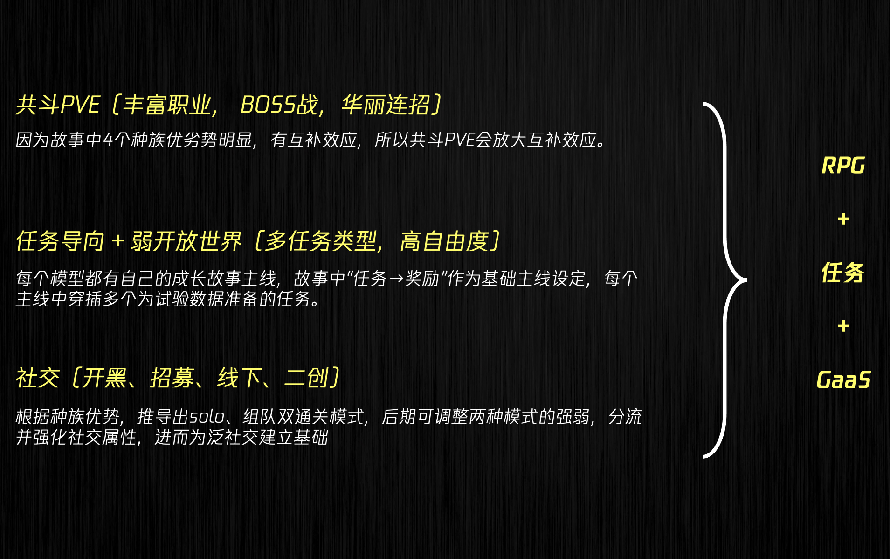


基于这篇小说，延展到游戏行业的想象



## 小说背景

未来世界，科技和文明高度发达，人类可选择对大脑或者肢体进行升级改造。经过多年发展，逐步衍生出追求高级智慧的“智者”族群，追求突破体能极限的“锐行者”族群，主流社会将其定义为人类（这一物种）的两个亚种。当然也存在完全由科技制造出来的仿生人，仿生人有着简单的意识和情感，主要依据人类（包含亚种）的命令行事。

与此同时，在世界上某个隐秘的角落，还存在着一群不愿意进行任何改造的人类（本源人），他们的祖辈认为只有完整保持人类的自然属性，才是纯粹的人类。这部分人群在很早之前就与衍化出亚种时的人类社会达成了协定，离群别居，建立了自己的乌托邦，长久以来也与高速发展的外界社会进行了物理隔离与信息隔离，成为了桃花源式的存在。

时光流逝，本源人开始逐步的意识到可能有外界社会的存在，产生了强烈的怀疑感与虚无感；外界社会关于是否应该给本源人一个重新选择机会的讨论也日益激烈，并开始为接纳本源人的回归做前期准备。

由于目前的人类社会已经存在了智者、锐行和仿生人三类族群，他们有着各自的特质，但无法从外表进行区分，如何引导本源人重新认识人类，融入族群，成了准备工作的首选考虑要素之一。为此，世界政府成立了桃源实验室，并启动了“武陵计划”作为引导的第一步……

## 游戏世界观

从小说最后章节我们可以看出作者关于整个世界观的构建。

人类分离出的四个**族群**（不严谨的说，也可以叫**亚种**）：
- 智者
- 锐行者
- 仿生人
- 本源人

四个族群让原本复杂的人类社会，陷入更加复杂的巨变中。

一方面：对新新人类的好奇，冲突，理解，共存，在各种场景中，往返不定，纠结摇摆。

另一方面：社会的基本秩序总是在分久和、和久分的自然规律中，迭代演化，终一前行。

**本部小说作为引子，引出基本设定和潜在冲突点，并将整个世界观划分为三个阶段：**

## 游戏玩法初探

根据训练AI模型的基础设定，以及每一次训练都需要完成一次任务，所以本游戏设计成局内 + 局外，双循环体系

### 局内玩法

> 局内核心： 任务导向

每一次实验，都对应一个任务过程

> 任务类型：强PVE导向（合作收益远大于solo收益）

RPG、解谜、战斗、救援、……

> 任务目标：收集训练模型所需数据，可能包括：

- 族群分类 —— 类似本小说的任务目标
- 肌体波动数据
- 能力最大值
- 心理/情绪波动情况
- 族群间合作可能性
- 族群间对抗可能性
- ……

> 玩法特色：灵活的局内装备/道具 + 族群特色

只能使用本族武器，同一道具使用效果不同，……

### 局外循环

> 局外核心：个体（模型）养成

4大族群，N种职业。玩家可同时养多个个体（模型）

> 个体成长体系：

- 关键故事：游戏主线（每个个体不同的成长故事）
- 核心数值：体力、智力、……
- 技能、装备、载具等其他成长体系

> 氪金点：氪金点只存在于局外体系

氪金点不能影响游戏平衡。可在：抽角色、时装、载具外观等安插氪点

## 核心玩法总结

