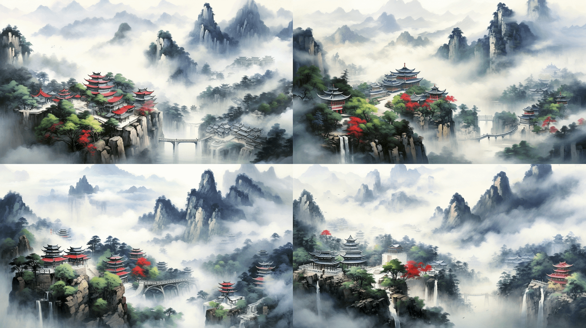

确定的章节标题：


After a prolonged sojourn within the confinements of a cage, one has finally regained the embrace of the natural world. - Tao Yuanming, "Returning to the Countryside and My Farm"



When faced with the light, shadows linger behind us. - Helen Keller



Just as a butterfly cannot fly across the vast ocean, no one can bear to blame it. — Lin Xi



All sufferings stem from longing, attachment, and desire. - Edgar Allan Poe



I once depicted the scene of Lingling County through my art, but only today do I realize that my painting falls short. - Ouyang Xiu, "Ode to Lingling"



I am no longer the person I used to be, the young individual who possessed an innocent and fervent belief. Bid me goodnight. - Stephen King, "Revival"



Believers bask in felicity, while skeptics exhibit sagacity. - Edgar Allan Poe



The transformation of ideas and the power of human will have shaped the world we live in today. - Hayek, "The Road to Serfdom"


Backup：

Alternative four-panel image proposal：

