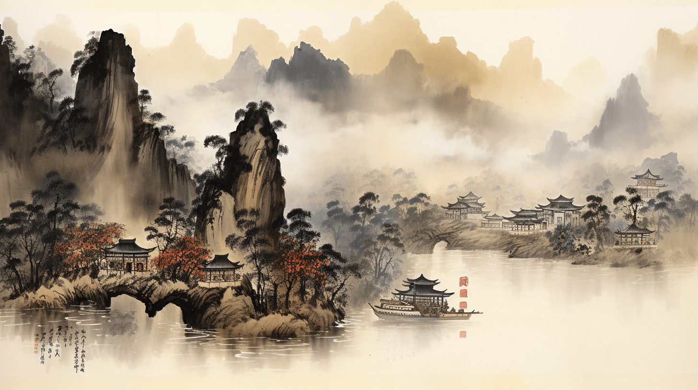
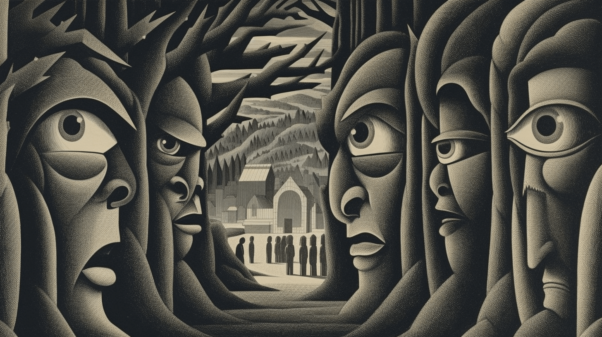
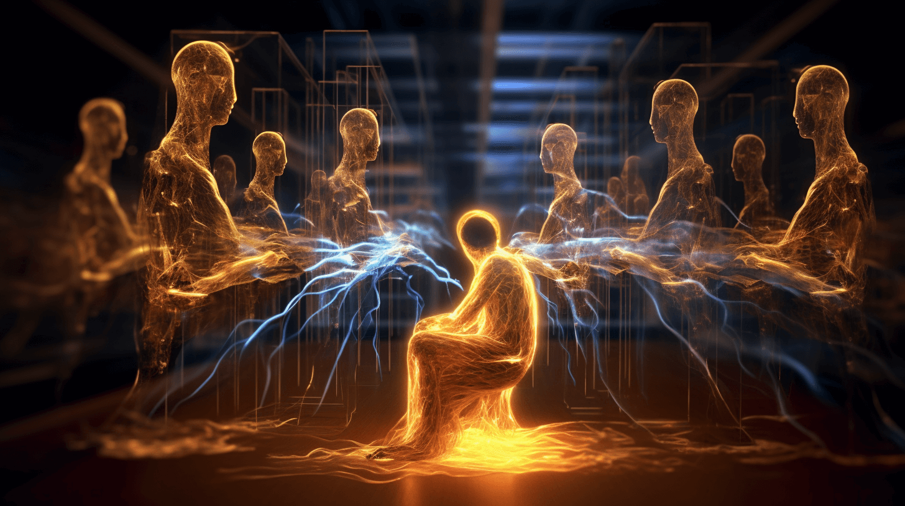
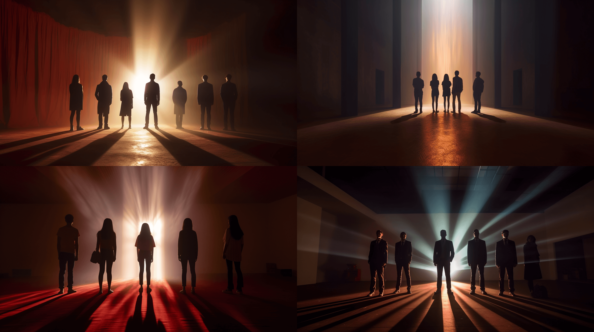

确定的章节标题：


第1章 ：    久在樊笼里，复得返自然。 —— 陶渊明《归园田居》



第2章 ：    面对光明，阴影就在我们身后。 —— 海伦·凯勒



第3章 ：    就像蝴蝶飞不过沧海，没有人忍心责怪。 —— 林夕



第4章 ：    所有苦难都来自渴望、依恋和欲望。 —— 埃德加·爱伦·坡



第5章 ：    画图曾识零陵郡,今日方知画不如。 —— 欧阳修《咏零陵》



第6章 ：    我已经不再是那个人了，那个怀着天真信仰的年轻人。跟我道晚安吧。 —— 斯蒂芬·金 《重生》



第7章 ：    信徒是幸福的，怀疑者是明智的。 —— 埃德加·爱伦·坡



第8章 ：    观念的转变和人类意志的力量，塑造了今天的世界。 —— 哈耶克《通往奴役之路》


其他备选方案：

其他四格图片方案：

